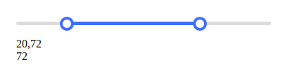

# Range slider



```html
    <div class="y-range-slider"></div>
```

```javascript
    let rangeSlider = new RangeSlider({
        el: '.y-range-slider',
        // min: 0,
        // max: 100,
        // step: 1,
        value: [ 10, 90 ], // or [1]  [10,20,30]
        onChange: setValueShow,
        onPointPosition(offset) {
            document.querySelector('.active-point-offset').innerHTML = offset
        }
    })
```